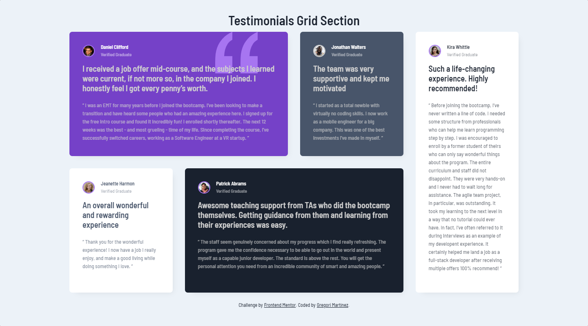

# Frontend Mentor - Testimonials grid section solution

This is a solution to the [Testimonials grid section challenge on Frontend Mentor](https://www.frontendmentor.io/challenges/testimonials-grid-section-Nnw6J7Un7). Frontend Mentor challenges help you improve your coding skills by building realistic projects. 

## Table of contents

- [Overview](#overview)
  - [The challenge](#the-challenge)
  - [Screenshot](#screenshot)
  - [Links](#links)
- [My process](#my-process)
  - [Built with](#built-with)
  - [What I learned](#what-i-learned)
  - [Continued development](#continued-development)
  - [Useful resources](#useful-resources)
- [Author](#author)

## Overview

### The challenge

Users should be able to:

- View the optimal layout for the site depending on their device's screen size.

### Screenshot

Here you can see how looks the final result.

### Links

- Click this URL to check the: [Repository](https://github.com/GregoriM04/testimonials-grid-section-main)
- Click this URL to see the: [Live site](https://gregorim04.github.io/testimonials-grid-section-main/)

## My process

### Built with

- Semantic HTML5 markup
- CSS custom properties
- CSS Grid
- Flexbox
- Mobile-first workflow

### What I learned

With this project, I was able to learn and use CSS Grid properties. It's awesome because such properties allowed me to design specific layouts depending on the device one can see it.

### Continued development

It's very important to have tools like Css grid always fresh when doing projects because it's a widely used one and by practicing, I know I can use it with no significant difficulties.

### Useful resources

- [CSS Grid Layout by MDN Web Docs](https://developer.mozilla.org/en-US/docs/Web/CSS/CSS_Grid_Layout) - This helped me to understand the basis of CSS Grid wih basic examples and easy-to-follow snipets.

## Author

- LinkedIn - [Gregori Martinez](https://www.linkedin.com/in/gregorim04/)
- Frontend Mentor - [@GregoriM04](https://www.frontendmentor.io/profile/GregoriM04)
- Twitter - [@GregoriM04](https://twitter.com/GregoriM04)
